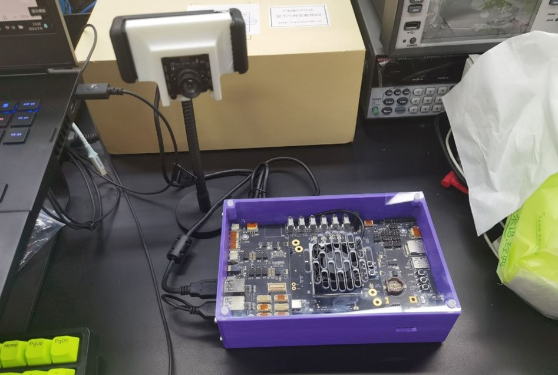
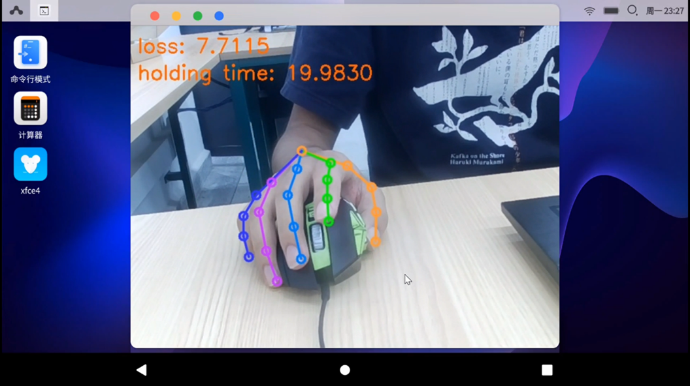
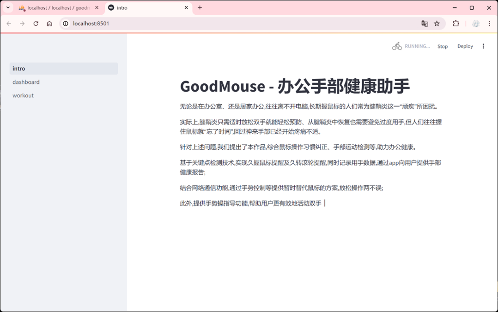
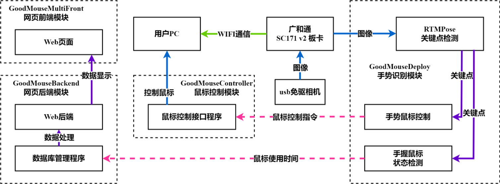

# GoodMouse

> @2024.8 古德茅斯 

## 简介
2024嵌入式芯片与系统设计大赛应用赛道参赛作品《鼠不胜手-办公手部健康助手》代码开源

### 基本功能

#### 手势鼠标

参考 https://www.computervision.zone/courses/advance-computer-vision-with-python/

#### 久握鼠标检测

#### 用手数据统计

## 项目结构

包括板端（Edge）和电脑端（PC）两部分

## TODO

- https://github.com/ProgrammingHero1/eye_controlled_mouse.git

